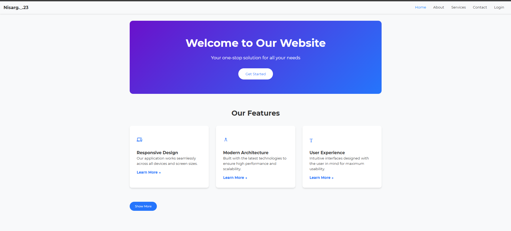
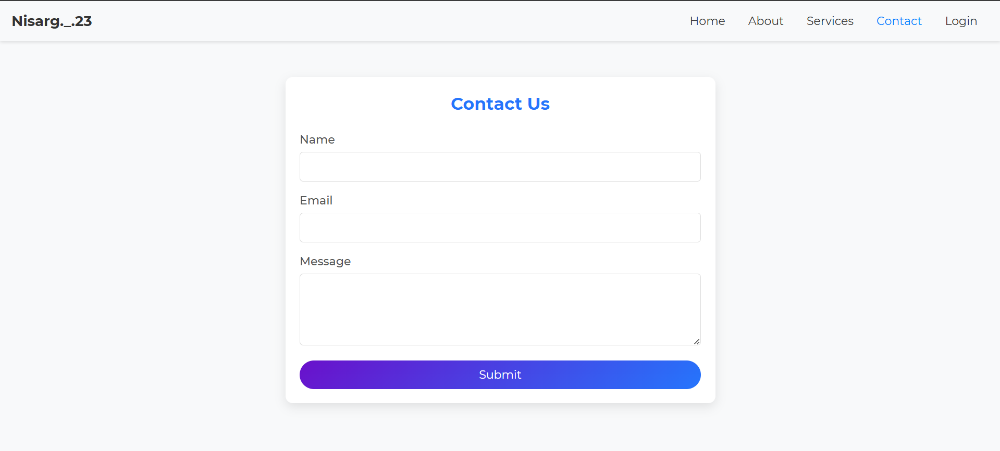
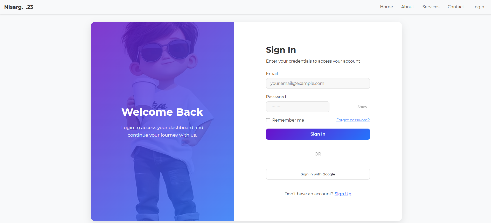

[//]: # (# ✨ Modern Web Services Platform)

[//]: # ()
[//]: # (![Angular]&#40;https://img.shields.io/badge/Angular-DD0031?style=for-the-badge&logo=angular&logoColor=white&#41;)

[//]: # (![TypeScript]&#40;https://img.shields.io/badge/TypeScript-007ACC?style=for-the-badge&logo=typescript&logoColor=white&#41;)

[//]: # (![CSS3]&#40;https://img.shields.io/badge/CSS3-1572B6?style=for-the-badge&logo=css3&logoColor=white&#41;)

[//]: # ()
[//]: # (A modern, responsive web application built with Angular 19, featuring a sleek services showcase and interactive contact form.)

[//]: # ()
[//]: # (## 🚀 Features)

[//]: # ()
[//]: # (- **Service Showcase** - Beautiful presentation of services with hover animations)

[//]: # (- **Contact Form** - Interactive form with validation and visual feedback)

[//]: # (- **Modern UI** - Gradient effects, responsive design, and smooth animations)

[//]: # (- **Optimized Performance** - Built with Angular's latest features for speed and efficiency)

[//]: # ()
[//]: # (## 📸 Screenshots)

[//]: # ()
[//]: # (<div align="center">)

[//]: # (  )

[//]: # (  )

[//]: # (</div>)

[//]: # ()
[//]: # (## 🔧 Installation)

[//]: # ()
[//]: # (```bash)

[//]: # (# Clone the repository)

[//]: # (git clone https://github.com/your-username/modern-web-services.git)

[//]: # ()
[//]: # (# Navigate to project directory)

[//]: # (cd modern-web-services)

[//]: # ()
[//]: # (# Install dependencies)

[//]: # (npm install)

[//]: # (```)

[//]: # ()
[//]: # (## 🏃‍♂️ Development)

[//]: # ()
[//]: # (```bash)

[//]: # (# Start development server)

[//]: # (ng serve)

[//]: # ()
[//]: # (# Open your browser at)

[//]: # (http://localhost:4200/)

[//]: # (```)

[//]: # ()
[//]: # (## 🛠️ Building for Production)

[//]: # ()
[//]: # (```bash)

[//]: # (# Create optimized production build)

[//]: # (ng build)

[//]: # (```)

[//]: # ()
[//]: # (The build artifacts will be stored in the `dist/` directory.)

[//]: # ()
[//]: # (## 🧪 Testing)

[//]: # ()
[//]: # (```bash)

[//]: # (# Run unit tests)

[//]: # (ng test)

[//]: # ()
[//]: # (# Run end-to-end tests)

[//]: # (ng e2e)

[//]: # (```)

[//]: # ()
[//]: # (## 💻 Technology Stack)

[//]: # ()
[//]: # (- **Frontend**: Angular 19, TypeScript, CSS3)

[//]: # (- **Form Handling**: Angular Reactive Forms)

[//]: # (- **Styling**: Custom CSS with gradient effects)

[//]: # (- **Animations**: CSS transitions and Angular animations)

[//]: # ()
[//]: # (## 🤝 Contributing)

[//]: # ()
[//]: # (Contributions are welcome! Please feel free to submit a Pull Request.)

[//]: # ()
[//]: # (1. Fork the repository)

[//]: # (2. Create your feature branch &#40;`git checkout -b feature/amazing-feature`&#41;)

[//]: # (3. Commit your changes &#40;`git commit -m 'Add some amazing feature'`&#41;)

[//]: # (4. Push to the branch &#40;`git push origin feature/amazing-feature`&#41;)

[//]: # (5. Open a Pull Request)

[//]: # ()
[//]: # (## 📝 License)

[//]: # ()
[//]: # (This project is licensed under the MIT License - see the [LICENSE]&#40;LICENSE&#41; file for details.)

[//]: # ()
[//]: # (## 📞 Contact)

[//]: # ()
[//]: # (Your Name - [@your_twitter]&#40;https://twitter.com/your_twitter&#41; - email@example.com)

[//]: # ()
[//]: # (Project Link: [https://github.com/your-username/modern-web-services]&#40;https://github.com/your-username/modern-web-services&#41;)

[//]: # ()
[//]: # (---)

[//]: # ()
[//]: # (<p align="center">)

[//]: # (  Made with ❤️ using Angular)

[//]: # (</p>)


# 🌟 Modern Web Services Platform 🌟

<div align="center">

<div align="center" style="border-radius: 20px; ">
    
</div>


[//]: # ()
[//]: # (![Nisarg._.23]&#40;https://via.placeholder.com/1200x300/6a11cb,2575fc/FFFFFF/?text=Modern+Web+Services&#41;)

[](https://angular.io/)
[](https://www.typescriptlang.org/)
[](https://developer.mozilla.org/en-US/docs/Web/CSS)
[](https://angular.io/guide/reactive-forms)
[](LICENSE)

<h3>A stunning, responsive web platform built with Angular 19, featuring gradient UI effects, interactive animations, and seamless user experience</h3>
</div>

<br>

## 🌈 Visual Preview

<div align="center">
  
  <p><strong>Home</strong></p>

  
  <p><strong>Services</strong></p>

  
  <p><strong>Contact</strong></p>

  
  <p><strong>Login</strong></p>
</div>

## ✨ Key Features

<table>
  <tr>
    <td>
      <h3>🎨 Design Elements</h3>
      <ul>
        <li>Gradient UI components</li>
        <li>Responsive layout for all devices</li>
        <li>Smooth hover animations</li>
        <li>Custom glowing effect directive</li>
      </ul>
    </td>
    <td>
      <h3>🔧 Technical Features</h3>
      <ul>
        <li>Angular Reactive Forms with validation</li>
        <li>Component-based architecture</li>
        <li>Optimized performance</li>
        <li>Custom CSS transitions</li>
      </ul>
    </td>
  </tr>
</table>

## 🚀 Quick Start

```bash
# Clone this beautiful project
git clone https://github.com/your-username/modern-web-services.git

# Enter the project directory
cd modern-web-services

# Install all dependencies
npm install

# Launch the development server
ng serve
```

Then visit ✨ http://localhost:4200/ ✨ to see the magic!

## 💡 Feature Highlights

<div align="center">
  <table>
    <tr>
      <td align="center">
        
        <br><strong>Service Grid Layout</strong>
        <br>Beautifully organized services with hover effects
      </td>
      <td align="center">
        
        <br><strong>Form Validation</strong>
        <br>Real-time feedback with visual indicators
      </td>
      <td align="center">
        
        <br><strong>Gradient Effects</strong>
        <br>Modern UI with stunning gradient backgrounds
      </td>
    </tr>
  </table>
</div>

## 🛠️ Development Commands

| Command | Description |
|---------|-------------|
| `ng serve` | Start development server |
| `ng build` | Build production-ready app |
| `ng test` | Execute unit tests |
| `ng e2e` | Run end-to-end tests |
| `ng lint` | Check code style |

## 🧩 Code Showcase

<details>
<summary>✨ Contact Form Validation</summary>

```typescript
this.contactForm = this.formBuilder.group({
  name: ['', Validators.required],
  email: ['', [Validators.required, Validators.email]],
  message: ['', Validators.required]
});
```
</details>

<details>
<summary>✨ Gradient UI Elements</summary>

```css
.submit-button {
  background: linear-gradient(135deg, #6a11cb, #2575fc);
  color: white;
  border-radius: 25px;
  transition: all 0.3s ease;
}
```
</details>

## 💻 Technology Stack

<div align="center">
  <table>
    <tr>
      <td align="center"><br>Angular 19</td>
      <td align="center"><br>TypeScript</td>
      <td align="center"><br>CSS3</td>
    </tr>
  </table>
</div>

## 📋 Project Roadmap

- [x] Service component with hover animations
- [x] Contact form with validation
- [x] Responsive design implementation
- [x] Custom CSS effects and transitions
- [ ] Dark/Light theme toggle
- [ ] User authentication system
- [ ] API integration for form submission

## 🤝 Contributing

Contributions make the open-source community amazing! We welcome your contributions:

```
🌱 Fork → 🔧 Create Feature Branch → 🧪 Commit Changes → 🚀 Push → ✨ Submit PR
```

## 📬 Contact & Support

<div align="center">
  <a href="https://github.com/Nisarg284"></a>
  <a href="nisargsolanki284@gmail.com"></a>

[//]: # (  <a href="https://twitter.com/your_twitter"></a>)
</div>

<br>

---

<div align="center">

[//]: # (  )

  <p>
    <strong>Made with ❤️ and Angular</strong>
    <br>
    © 2024 Nisarg._.23 | MIT License
  </p>
</div>
